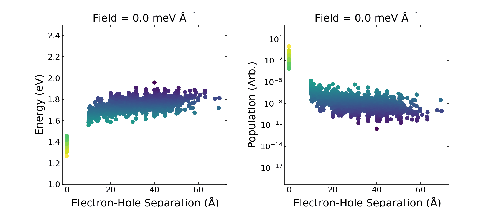

# Modelling Organic Crystals Using a Lattice Hamiltonian

## Description

In this project, we use a simplified model of an organic crystal to calculate the system's excited states under illumination and their populations. We then investigate how changing the input parameters of the model changes the nature of the excited states. An example is shown in the GIF below where we demonstrate how applying an electric field changes the energies and populations of the eigenstates. 



## Learning Outcomes

- Techniques to speed up ```for``` loops
- How to run ```for``` loops in parallel uing the ```multiprocessing``` package
- How to plot heatmaps using the ```seaborn``` package

## Requirements

<!--
If your exemplar requires students to have a background knowledge of something
especially this is the place to mention that.

List any resources you would recommend to get the students started.

If there is an existing exemplar in the ReCoDE repositories link to that.
-->

### Academic
- Intermediate-level python ability
- Strong, undergraduate-level understanding of quantum mechanics (recommended)
- Basic familiarity with solid state physics (recommended)

### System
- See the [pyproject.toml](pyproject.toml) file

## Getting Started

Start by reading through sections 1-4 which describe the physics underlying this exemplar and the structure of the code. 

Once you have been through this, you can work through the next four sections. In the first of these, we walk you through how to use the code and investigate how the eigenstates of the system change when we change the strength of the coupling between lattice sites. The next three sections focus in detail on short extracts from the code which are relevant to the learning outcomes of this exemplar. 

There are lots of things which the code can be used to do that aren't explicitly covered here! If you want a challenge, try to figure our how you could recreate the GIF shown above. Considering the eigenstates with the highest probability of being occupied, what changes about their electron-hole separation as the electric field strength is increased?

<!-- Change this to your License. Make sure you have added the file on GitHub -->

## License

This project is licensed under the [BSD-3-Clause license](LICENSE.md)
