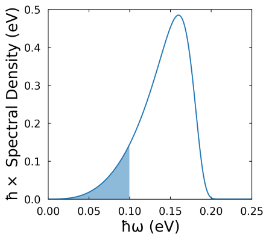

# Introduction

In this ReCoDe exemplar, we use quantum mechanics to describe the photoexcited states of a molecular crystal and explore how the properties of these states, such as their energies, vary as we alter different input parameters. To do this, we model the system using a tight-binding Hamiltonian, the eigenstates of which correspond to the system's photoexcited states. In the Hamiltonian, we account for the following interactions between the excited states:

- The electrostatic interaction between spatially separated electrons and holes.
- The electronic coupling between molecules which allows electons and holes to move from one lattice site to an adjacent lattice site.
- The energetic stabilisation of electrons and holes which are located on the same lattice site (i.e., exciton formation).
- The interaction between spatially separated excitonic states (i.e., energy transfer).

Below, we describe the construction of the Hamiltonian in greater detail and we explain how we include each of these interactions. 

## Constructing the Hamiltonian 
To model the system, we consider a 2D lattice in which each site represents a molecule. When a molecule is photoexcited, one electron will move from the highest occupied molecular orbital (HOMO) to the lowest unoccupied molecular orbital (LUMO). Due to the low dielectric constant of organic materials, the resulting electron-hole pair will form a tightly bound state called a Frenkel exciton. This excitonic state is energetically stabilised relative to two free charges in the same material, meaning that its energy is lower than the bandgap of the material by an amount termed the exciton binding energy. For the electron and hole to spatially separate from one another and become free charges, they must overcome this binding energy. Typically, this is not a spontaneous process and requires, for example, the applicaiton of an electric field. 

To account for the different properties of the system's exctied states, our model contains two types of basis state: excitons, when the electron and hole occupy the same lattice site and electron-hole pairs, when the electron and hole are located on different lattice sites. The energy of excitonic states, $E_{\mathrm{ex}}$, is given by 

$E_{\mathrm{ex}}=E_{\mathrm{LUMO}}-E_{\mathrm{HOMO}}-E_{\mathrm{B}}$

In which $E_{\mathrm{LUMO}}$ and $E_{\mathrm{HOMO}}$ and the energy levels of the LUMO and HOMO, respectively and $E_{\mathrm{B}}$ is the exciton binding energy. The energy of electron-hole pairs is given by

$E(|\vec{r}|)=E_{\mathrm{LUMO}}-E_{\mathrm{HOMO}}-\frac{J_{0}}{1-|\vec{r}|/r_{\mathrm{0,j}}}$

where $\vec{r}$ is the vector connecting the electron-hole pair, and the second term represents the electrostatic attraction between them, which we have modelled using the Mataga potential. The Mataga potenial is parameterised by the two variables $J_{0}$ and $r_{\mathrm{0,j}}$. The model can also include the effects of uniform electric field, $\vec{F}$, by altering the energies of electron-hole basis elements by an amount $\Delta E= \vec{r}∙\vec{F}$.

These energies form the diagonal elements of the Hamiltonian. To simulate the disorder commonly found in the site energies of organic crystals, the model includes a Gaussian disorder term, which is added to the diagonal elements of the Hamiltonian. 

In the off diagonal elements, we consider interactions between the basis states. Each exciton is weakly coupled to other excitons in the lattice, and we model this using a dipole-dipole interaction which takes the functional form: $^{1}$

$$ d(|\vec{r}|)=   
\begin{cases}
\frac{d_{0}}{(1+(|\vec{r}|-a)/r_{\mathrm{0,d}})^{3}}  &\text{ if } 0 \leq |\vec{r}| \leq r_{\mathrm{coupled}} \\
0 &\text{ if } |\vec{r}| > r_{\mathrm{coupled}}
\end{cases}  $$

where $d_{0}$ and $r_{\mathrm{0,d}}$ are the two parameters which characterise the strength of the dipole-dipole interaction, $a$ is the spacing between lattice sites and $r_{\mathrm{coupled}}$ is a parameter which controls the maximum separation which a pair of excitons can have for their couipling to be included in the Hamiltonian. Typically, we set this to $1.45a$ since the $|\vec{r}|^{-3}$ dependence of $d(|\vec{r}|)$ means that the coupling between exciton pairs is generally negligible for pairs which are further apart than diagonal neighbours

In addition to this coupling between excitonic states, it is also possible for the electron (hole) to hop to a neighbouring lattice site, leaving the initial molecule with a positive (negative) charge and giving one of its neighbours a negative (positive) charge. The size of the coupling describing this interaction depends on the wavefunction overlap between the molecules involved, which typically decays exponentially with distance. Thus, we assume that this type of interaction can only take place between directly adjacent lattice sites and it is parameterised by the electronic coupling $t_{\mathrm{0,LUMO}}$ ($t_{\mathrm{0,HOMO}}$). 

Putting these parts together, we can write the Hamiltonian describing the electronic states as

$$
\hat{H}= \sum_{k} E_{\mathrm{ex}}|k,k⟩⟨k,k| + \sum_{i \neq j}(E(|\vec{r}|)-q\vec{r}∙\vec{F})|i,j⟩⟨i,j| + \sum_{k \neq k'}d(|\vec{r}|)|k,k⟩⟨k',k'| \ldots
$$

$$
\ldots + \sum_{i \neq j, j'} t_{\mathrm{0,HOMO}}|i,j⟩⟨i,j'| + \sum_{i, i' \neq j}t_{\mathrm{0,LUMO}}|i,j⟩⟨i',j|
$$

where basis states indexed with k are excitonic in character, while those indexed using i and j describe electron-hole pairs. The i index refers to the lattice site on which the electron is located and the j index to that on which the hole is localised. We then diagonalise this Hamiltonian to find the eigenstates and energy levels of the system.

 $^{1}$ We note that this form of the dipole-dipole interaction is equivalent to assuming that the transition dipole moments of the basis states are all oriented parallel to one another. 

## Coupling to the Environment

While the Hamiltonian described in the previous section calculates the electronic eigenstates of the system, it neglects their coupling to the environment. As the crystal is at a non-zero temperature, the molecules making up the crystal will be in motion. Due to the relatively floppy nature of organic molecules, this thermal motion can cause their conformation (i.e., the arrangement of the atoms in each molecule) to fluctuate significantly. These fluctuations in the molecular conformations affect the energies of the (excited) electronic states and can drive transitions between them, as discussed in [Section Two](02_FindingSteadyStatePopulations.md).

In organic crystals, the dominant thermally activated motions are typically vibrations of the intramolecular bonds of the individual molecules in the lattice (e.g., C=C or C-H bonds). Each distinct type of vibration for a given molecule is referred to as a 'mode'. The energies of these vibrational modes and the strength with which each molecule couples to them can be summarised by a single function called the spectral density function, $J(\hbar\omega)$. In this function, $\hbar\omega$ refers to the energy of the vibrational mode and the magnitude of $J$ is proportional to the strength of the coupling. The spectral density function used in this exemplar is shown in Figure One, below, and is defined mathematically in [Appendix Two](A2_SpectralDensityFunctional.md). 

**Figure One**: The spectral density function used in this exemplar. The shaded region indicates the portion of the spectral density function which contributes to the outer reorganisation energy, a parameter which is used in the calculation of the excitons' decay rate if this is not assumed to be constant (see [Appendix One](A1_EnergyDependentRecombinationRates.md)).
