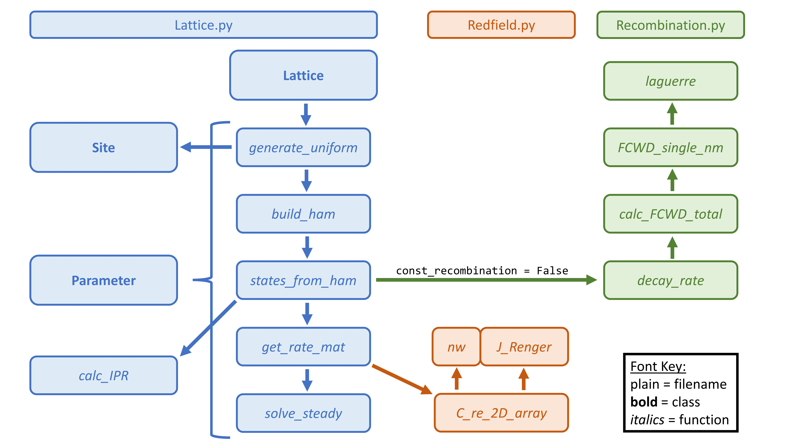

# Summary



The structure of the ```lattice_hamiltonian``` module is illustrated in the above schematic. The core of the code is the `Lattice` class in the `lattice.py` file. This class contains all the methods needed to construct the Hamiltonian (`generate_uniform` and `build_ham`), find its eigenstates (`states_from_ham`) and calculate their steady-state populations (`get_rates_mat` and `solve_steady`). The methods `states_from_ham` and `get_rates_mat` call on helper functions from the files `Recombination.py` and `Redfield.py`, respectively, though `Recombination.py` is only used if `const_recombination` is set to `False` (see [Section Three](03_CalculatingEigenstateProperties.md)). 

In addition to the `Lattice` class, the `lattice.py` file also contains the `Parameter` and `Site` dataclasses. The former contains the values of global variables, such as temperature, which are used in all the other functions and the latter contains the properties of each individual site in the lattice and is called by the `generate_uniform` method. These sites are then used to define the basis set in which the Hamiltonian is built by the `build_ham` method. 

To see an example of how the lattice class can be instantiated and used, refer to the `RunLattice.py` file. If you would like to try running the code, you can use the `WorkedExample.ipynb` file to see how changing the electronic coupling affects the energies and distributions of the system's eigenstates. 

