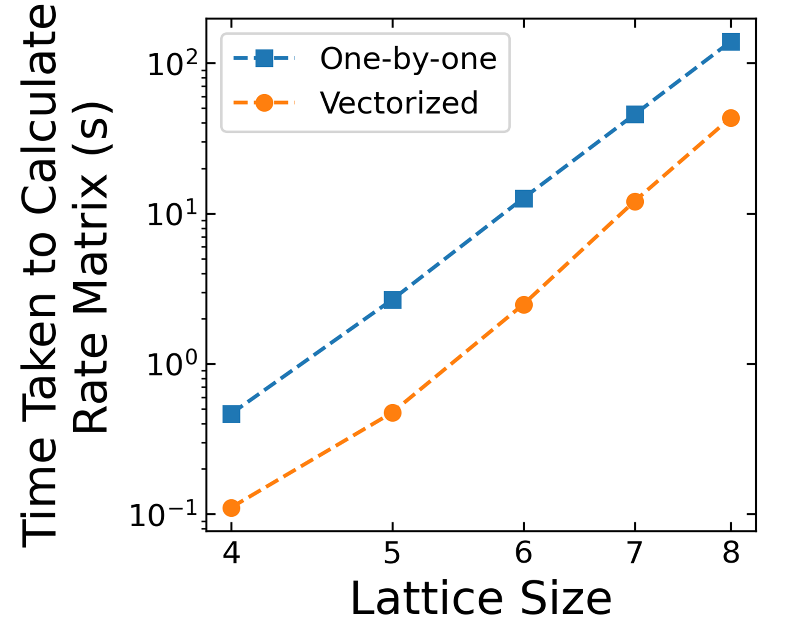

# Speeding up ```for``` loops: the ```get_rate_mat``` function

The purpose of the ```get_rate_mat``` function in ```lattice.py``` is to calculate the elements of the rate matrix which describes the rate of population transfer between the excited states of the lattice. Each element of the rate matrix takes the form 
```math
k_{\alpha \beta}(\omega_{\alpha \beta}) = \left[ \sum_{k}|c_{kk}^{(\alpha)}|^{2}|c_{kk}^{(\beta)}|^{2} + \sum_{i\neq j}|c_{ij}^{(\alpha)}|^{2}|c_{ij}^{(\beta)}|^{2} + \sum_{j\neq i}|c_{ij}^{(\alpha)}|^{2}|c_{ij}^{(\beta)}|^{2} \right] C(\omega_{\alpha \beta})
```
as is described in greater detail [here](02_FindingSteadyStatePopulations.md). Looking at this summation, we see that each term in the rate matrix requires a summation over all the basis states of the system (basis states are indexed using the latin alphabet, and eigenstates using the greek alphabet). For a $N\times N$ lattice, the number of basis states is $N^{4}$. In addition to this, the rate matrix itself contains $N^{2}$ elements as we calculate rates between every possible pair of eigenstates. Thus, the calculation of the rate matrix scales as $N^{8}$ meaning that it limits the speed of the code for all but the smallest lattice sizes. This means that we need this function to run as quickly as possible in order to minimise the overall runtime of the code and, in this file, we will explore some of the techniques we have used to achieve this. 

## 1) Vectorize functions

Vectorizing functions is always a good first step to speed up python code. Simply put, a vectorized function is one which can perform an operation on multiple elements of an input array at once, rather than having to act on each element in turn. Many common opeartors in Python are already vectorized. For example, consider the following exponentiation:
```
x = np.linspace(0,100,101)
y = np.zeros(len(x))
for i in range(len(x)):
  y[i] = x[i]*x[i]
```
This can be easily replaced with 
```
y = x**2
```
In general, it is always good to try and use pre-exsisting functions from libraries such as numpy or scipy as these functions are typically vectorized and also use C to do much of the heavy lifting, making them much faster than equivalent functions written purely in Python. For example, in ```get_rate_mat```, we use the ```np.matmul``` function (equivalent to the ```@``` operator) to perform the summation over all of the lattice's basis states.

However, in some cases, there will not be a pre-existing function which does what you need and then it is best to write your own, vectorized function. We have done this to calculate the values of the correlation function ($C(\omega_{\alpha \beta})$ in the expression for $k_{\alpha \beta}(\omega_{\alpha \beta})$ above). Our functions are saved in the ```redfield.py``` file and we call them in ```get_rate_mat``` via the ```correlation_function_real_part``` function. However, to take advantage of the functions in ```redfield.py```, we first need to make a numpy array containing the difference in energy between each possible pair of eigenstates (i.e., the $\omega_{\alpha \beta}$) which we do using...

## 2) Generators

To make a numpy array containing the values of $\omega_{\alpha \beta}$, we combine the numpy function ```np.fromiter``` (see the documentation [here](https://numpy.org/doc/stable/reference/generated/numpy.fromiter.html)) with a generator written using the same syntax as a *list comprehension*. A list comprehension is a way of rewriting ```for``` loops which is particularly useful if the logic involved in each iteration of the for loop is simple enough to be encapsulated in a single line. For example, the code:
```
a = [1,2,3,4,5]
b = []
for i in range(len(a)):
  b.append(a[i]**2)
```
can be rewritten as:
```
a = [1,2,3,4,5]
b_list_comp = [i**2 for i in a]
```
which can then be turned into a generator as follows:
```
b_generator = (i**2 for i in a)
```
Generators are useful in situations when you want to perform an operation on a large number of values, but you don't want to store all the input values in the memory at once. 

In order to use our generator, we need to make it so that each element of the rate matrix is labelled by a single index, rather than needing to label both the row and the column (i.e., the values of $\alpha$ and $\beta$ in $k_{\alpha \beta}$). Fortunately, numpy has a built in function (```np.tril_indices_from```, see the [documentation](https://numpy.org/doc/stable/reference/generated/numpy.tril_indices_from.html)) which can generate an iterable of the indices describing the elements making up a lower (or upper) triangular matrix. 

By combining these steps of vectorization and using generators, we achieved a significant speed up in the time taken to claculate the rate matrix, as we show in the plot below (the code used to generate this plot can be found in [Appendix Three](https://github.com/ImperialCollegeLondon/ReCoDE_Lattice_Hamiltonian/blob/39-write-speeding-up-for-loops-documentation-v2/notebooks/A3_SpeedingUp-for-Loops-ExampleCode.ipynb)). However, note that both the lines run (roughly) parallel to one another; what does this tell us about the nature of the speed up achieved using these techniques?


