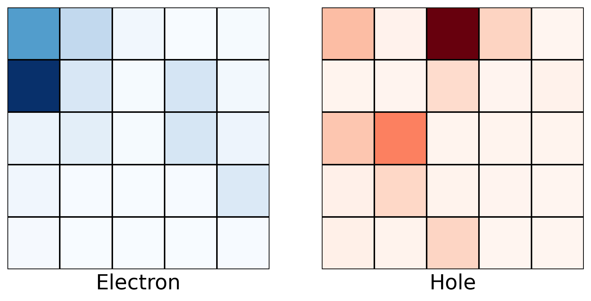
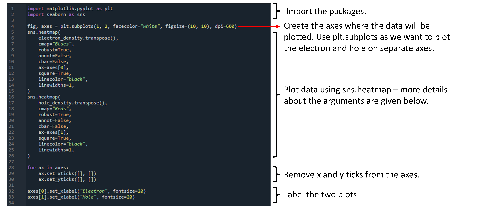

# Using ```seaborn``` to make heatmaps

Here, we will look at the ```plot_state_distribution``` function in the ```lattice_plots.py``` file. The purpose of this function is to plot how the electron and hole probability densities are distributed across the lattice. This is useful as it allows you to visualise how delocalised the eigenstates are. To see how this function can be used, we show an example of its output below (see also the final cell of the [WorkedExample](https://github.com/ImperialCollegeLondon/ReCoDE_Lattice_Hamiltonian/blob/main/notebooks/05-WorkedExample.ipynb) jupyter notebook):



A heatmap provides a convenient way to represent the electron and hole probability distributions for a 2D lattice. Although it is possible to make a heatmap using ```matplotlib```, the ```seaborn``` package provides an alternative method and the plots generated tend to look nicer for less effort than those obtained using ```matplotlib```. Consequently, we will discuss the ```seaborn``` package here. 

We start by exploring how the `plot_state_distribution` function works under the hood using `seaborn`. The following snippet shows a summary of the code, annotating what each part is doing:



We will now look at some of the arguemnts more closely, and you can find out more using the [documentation](https://seaborn.pydata.org/generated/seaborn.heatmap.html). The arguments which were particularly useful to make this plot look visually appealing were:
* ```robust``` - By default, seaborn maps the maximum and minimum colours of the heatmap you choose to the maximum and minimum values of the data being plotted. When plotting the occupation of the lattice sites, this behaviour is not desirable as most of the lattice sites have a very low occupation probaility and we want those sites to appear white, not light red/blue. Setting ```robust=True``` means that the colormap range is set by the data's interquartile range and so this issue is avoided.  
* ```ax```- This argument tells seaborn on which axis to plot the heatmap, overruling the default behaviour of using the current axis. It is useful here as we want to show the electron and hole probability distributions on different plots so that both can be seen clearly. 
* ```square``` - As we are simulating a square lattice, we would like the heatmap to reflect this. By setting ```square=True```, seabron automatically sets the axes aspect to "equal" so that each cell in the heatmap is sqaure-shaped. 

