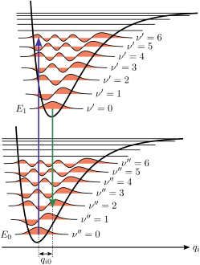

# Calculation of Recombination Rates Using Generalised Marcus-Levich-Jortner

If the `const_recombination` argument of the `Parameters` class is set to False, the eigenstate's decay rates are calculated using a version of Fermi's Golden Rule which has been adapted to describe organic molecules (the model is called generalised Marcus-Levich-Jortner and further detail can be found in references 1-3):

$k_{rec}^{\alpha} = \frac{2\pi}{\hbar} |V^{\alpha}|^2 FCWD^{\alpha}(\hbar\omega=0)$

where $FCWD$ refers to the Franck-Condon weighted density of states, which describes the wavefunction overlap between vibronic modes of the excited and ground states (see Figure One and reference 4). For non-radiative recombination, this is evaluated at $\hbar\omega = 0$ and is given by

$FCWD(0)=\frac{1}{\sqrt{4\pi\lambda_{l}kT}} \sum_(w=0)^{\infty}\sum_{t=0}^{\infty}\frac{e^{-S}S^{w-t} t!}{w!}\left[L_{t}^{w-t}(S)\right]^2 e^\left(-[E+\lambda_{l}+(w-t)\hbar\Omega]^2/4 \lambda_{l}kT\right)\frac{e^{-t\hbar\Omega⁄kT}}{Z_{\hbar\Omega}}$

for a transition from an excited state to the ground state. It is defined in terms of the energy of the excited state with respect to the ground state ($E$), the reorganization energy of thermally occupied low frequency phonon-modes coupled with the transition ($\lambda_{l}$), and the Huang-Rhys factor ($S$) of an effective high energy mode of energy $\hbar\Omega$ ($S = \lambda_{h}/\hbar\Omega$). These parameters are related to the reorganisation energy associated with the spectral density function described in the file [01_ModelDescription](01_ModelDescription.md) by defining $\lambda_{\mathrm{total}} = \lambda_{l} + \lambda_{h}$ and $\hbar\Omega$ is given by the value of the e_peak parameter. 

**Figure One:** Illustration of the Franck-Condon Principle. The $E_0$ ($E_1$) potential well represents the energy level of the ground (first excited) state as a function of the nuclear coordinate, $q_i$. The potential energy of the electronic state is modelled as having a quadratic depenence on $q_i$, giving rise to a series of vibronic modes for each electronic energy level. The number of phonons associated with a given vibronic mode is indicated by the quantum number $\nu$. The rate at which the first excited state decays to the ground state will depend upon the wavefunction overlap of the vibronic part of both wavefunctions. Picture credit: By Samoza, CC BY-SA 3.0, [Wikipedia](https://en.wikipedia.org/wiki/Franck%E2%80%93Condon_principle). 

The overlap of the wavefunctions associated with the vibronic modes is approximated using the generalized Laguerre polynomials of degree $t$, $L_{t}^{w-t}(S)$. The number of ground state and excited state phonon modes ($w$ and $t$, respectively) can generally be truncated depending on the temperature and energy of the effective mode. Phonon states are considered to be in thermal equilibrium and their occupation is normalised using the canonical partition function

$Z_{\hbar\Omega}=\sum_{t=0}^{\infty}e^{-t\hbar\Omega⁄kT}$

The coupling of the (delocalised) eigenstate to the ground state is calulated using:

$V_{\mathrm{ex}} = \sum_{kk}c_{kk}^{\alpha}V_{\mathrm{ex}}$

where $V_{\mathrm{ex}}$ is the coupling of excitonic basis elements. 

Additionally, the model takes into account the fact that delocalised excited states typically have longer lifetimes than more locailised ones. To do this, the reorganisation energies are reduced by a factor of the inverse participation ratio assoicated with the relevant state ($\mathrm{IPR}$, see description in [03_CalculatingEigenstateProperties](03_CalculatingEigenstateProperties.md)) :

$\lambda_{\mathrm{x,ex}}^{\alpha}= \frac{\lambda_{\mathrm{x,ex}}}{\mathrm{IPR_{ex}}}$

where $x$ can be either $l$ or $h$. 

# References
1) Sumi, H. Theory on Rates of Excitation-Energy Transfer between Molecular Aggregates through Distributed Transition Dipoles with Application to the Antenna System in Bacterial Photosynthesis. J. Phys. Chem. B 103, 252–260 (1999).
2) B. Taylor, N. & Kassal, I. Generalised Marcus theory for multi-molecular delocalised charge transfer. Chemical Science 9, 2942–2951 (2018).
3) Azzouzi, M., Yan, J., Kirchartz, T. et al. Nonradiative Voltage Losses in Bulk-Heterojunction Organic Photovoltaics. Phys. Rev. X 8, 031055 (2018).
4) [Chemistry LibreTexts](https://chem.libretexts.org/Courses/Pacific_Union_College/Quantum_Chemistry/13%3A_Molecular_Spectroscopy/13.07%3A_The_Franck-Condon_Principle). 
